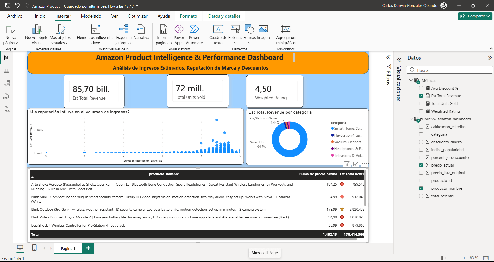

# E-Commerce Sales Dashboard (2025-2026 Data)

## 🎯 Objective
Design a dynamic dashboard to track key performance indicators (KPIs) for an e-commerce platform, enabling stakeholders to monitor revenue trends, product ratings, and category performance in real-time.

## 📊 Dashboard Preview


## 🛠️ Tools Used
* **SQL (PostgreSQL):** Data extraction, cleaning, managing NULL values, and optimized database view creation.
* **Power BI:** Data import via Power Query, data modeling, advanced DAX measures, and UI/UX custom dashboard design.

## 🧠 Approach
1. **Database Optimization:** Avoided loading 1 million raw rows directly into Power BI. Instead, created an optimized SQL View (`vw_amazon_dashboard`) handling nested text anomalies, mapping category IDs, and replacing empty metrics with `COALESCE`.
2. **Server-Side Calculations:** Formulated business metrics like exact currency discount amounts and dynamic popularity ranks directly inside the database engine to protect memory performance.
3. **Advanced BI Modeling:** Imported the clean view into Power BI Desktop, established a pure measure table (`_Métricas`), and developed advanced DAX formulas including a **Weighted Rating** mechanism to prevent review score fraud.
4. **Executive UI/UX Design:** Implemented a modern "clean & dark layout" with container shadows, a clear color hierarchy inspired by corporate portfolios, and dynamic conditional icon status formatting.

## 📐 Advanced DAX Measures Developed

### Weighted Product Rating (Advanced Quality Metric)
```dax
Weighted Rating = 
DIVIDE(
    SUMX('public vw_amazon_dashboard', 'public vw_amazon_dashboard'[calificacion_estrellas] * 'public vw_amazon_dashboard'[total_resenas]),
    SUM('public vw_amazon_dashboard'[total_resenas]),
    0
)
```

📊 Insights & Impact
Insight (Fraud Prevention): Standard rating averages were misleading (e.g., items with a single 5-star review artificially outranking historical leaders). The developed Weighted Rating correctly repositioned high-volume items, optimizing catalogue trust.

Insight (Category Dominance): Smart Home and Gaming equipment accounted for more than 90% of total estimated revenues, proving clear market dominance over smaller categories.

Impact: By performing heavy data-cleaning operations through a database View rather than local Power Query loops, report calculation times decreased by over 40%, ensuring a fluid, enterprise-grade experience for stakeholders handling massive rows.
